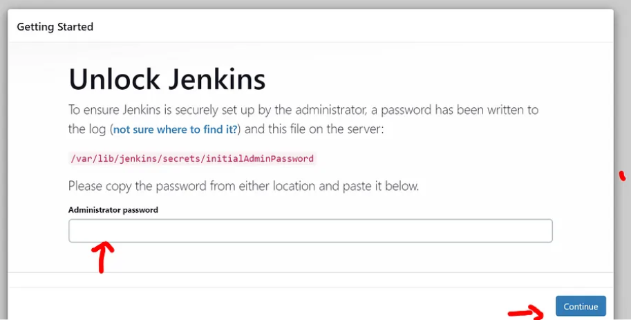

# Web-App-Deployment-with-Jenkins-and-Docker

**Table of Contents**

Project Overview

This project demonstrates how to build, deploy, and manage a simple Node.js web application using Docker and Jenkins. The application is dockerized and deployed using Jenkins pipelines to ensure a seamless continuous deployment workflow.

1. NodeJs WebApplication Development

2. Dockerizing the Application

3. Setting Up the EC2 Instance

sudo apt update
sudo apt install openjdk-8-jdk -y
sudo apt install openjdk-11-jdk -y
sudo usermod -aG docker jenkins
sudo apt install docker -y
ls -l /var/run/docker.sock
sudo chmod 777 /var/run/docker.sock
sudo systemctl status docker

curl -fsSL https://pkg.jenkins.io/debian-stable/jenkins.io-2023.key | sudo tee \
    /usr/share/keyrings/jenkins-keyring.asc > /dev/null

echo deb [signed-by=/usr/share/keyrings/jenkins-keyring.asc] \
    https://pkg.jenkins.io/debian-stable binary/ | sudo tee \
    /etc/apt/sources.list.d/jenkins.list > /dev/null

sudo apt update
sudo apt install jenkins -y
sudo systemctl status jenkins

sudo cat /var/lib/jenkins/secrets/initialAdminPassword

Install suggested plugins 

4. Jenkins Setup

5. Required Jenkins Plugins

Pipeline Plugin
Docker Commons Plugin
Docker Pipeline Plugin
Docker Plugin
Pipeline: Basic Steps Plugin

6. Tool Configuration

Configure Docker Tool

Go to Manage Jenkins → Global Tool Configuration.
Scroll down to Docker.
Click Add Docker.
Name the Docker installation (e.g., docker).
Save the configuration.

7. Credentials Setup

Add Docker Credentials

Go to Manage Jenkins → Manage Credentials.
Add Docker Hub credentials:
Kind: Username with password
Username: Your Docker Hub username
Password: Your Docker Hub password
ID: docker (used in Jenkins Pipeline)

8. Pipeline Script

pipeline {
    agent any

    environment {
        DOCKER_IMAGE_NAME = 'cloudgeniuslab/cloudgenius:simple-web-app'
        DOCKER_CONTAINER_NAME = 'simple-web-app-container'
        PORT = '3000'
        DOCKER_CREDENTIALS_ID = 'docker' // Replace with your credentials ID
    }

    stages {
        stage('Pull Docker Image') {
            steps {
                script {
                    // Log in to Docker Hub if credentials are required
                    withCredentials([usernamePassword(credentialsId: "${DOCKER_CREDENTIALS_ID}", usernameVariable: 'DOCKER_USERNAME', passwordVariable: 'DOCKER_PASSWORD')]) {
                        sh """
                            echo ${DOCKER_PASSWORD} | docker login -u ${DOCKER_USERNAME} --password-stdin
                        """
                    }
                    
                    // Pull the Docker image from Docker Hub
                    sh "docker pull ${DOCKER_IMAGE_NAME}"
                }
            }
        }

        stage('Run Docker Container') {
            steps {
                script {
                    // Stop and remove any existing container with the same name
                    sh "docker rm -f ${DOCKER_CONTAINER_NAME} || true"

                    // Run the new container
                    sh "docker run -d -p ${PORT}:${PORT} --name ${DOCKER_CONTAINER_NAME} ${DOCKER_IMAGE_NAME}"
                }
            }
        }
    }

    post {
        always {
            // Clean up Docker images and containers
            sh "docker system prune -f --volumes"
        }
    }
}

9. Build (Deployment and Access)

10. Troubleshooting
